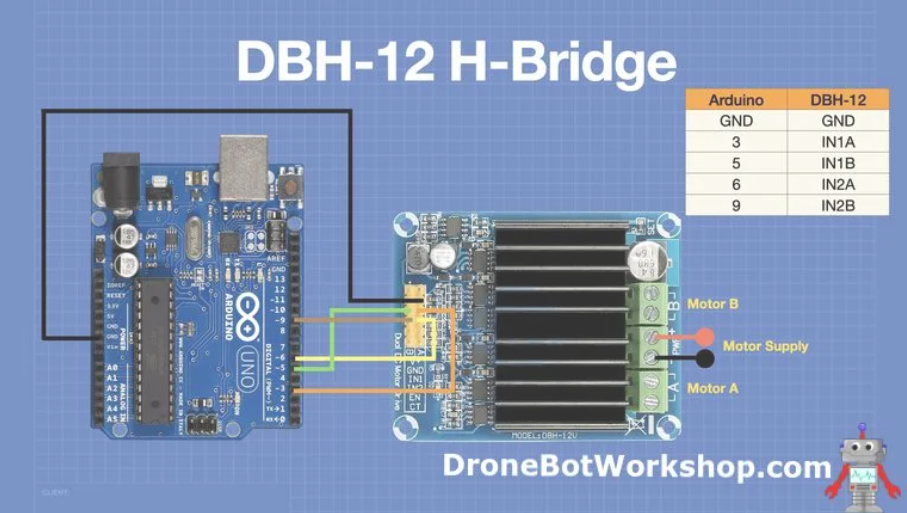
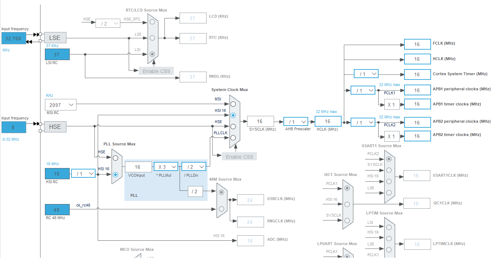
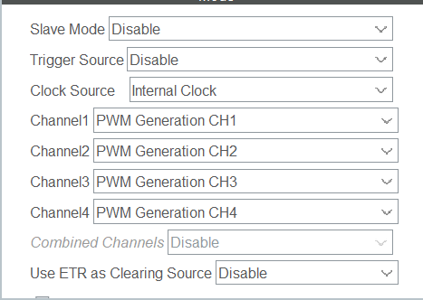
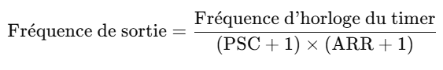
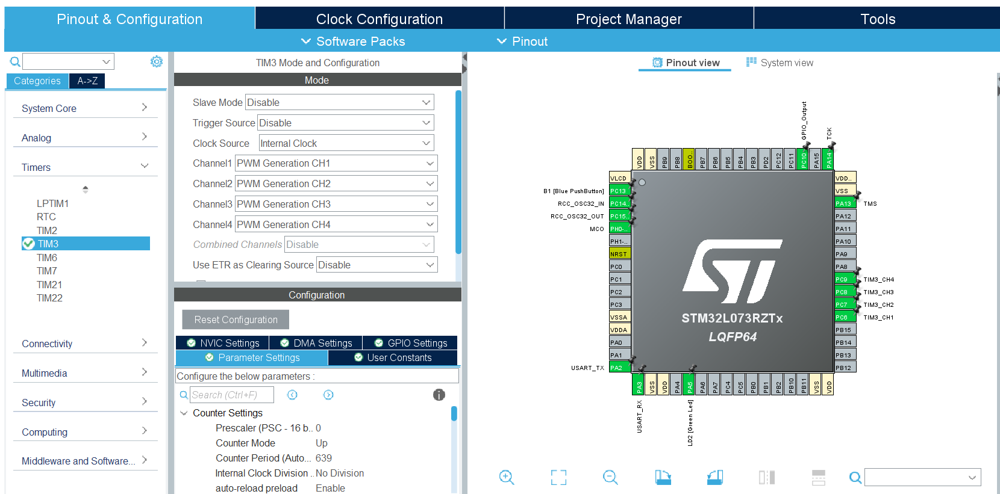

# Moteur CC
[Ref Moteur](https://www.pololu.com/product/4746)
## Montage moteur avec hacheur : 

Pour le montage, on utilise celui qui est donné avec la doc du hacheur (DBH-12):
[Doc Hacheur](https://dronebotworkshop.com/dc-motor-drivers/)
 
Montage (12V tiré du pcb alimentation):  
{ width="800" }

## Setup Cube STM32 : 
Pour manipuler nos moteurs, on utilise une stm32 (référence : STM32L073RZTx LQFP64). Pour coder nous utilisons donc le Cube STM32 (à télécharger via [ce lien](https://www.st.com/en/development-tools/stm32cubeide.html)

### Création d'un nouveau projet
dans le cube, il faut aller dans file/new/STM32 project. Mettre ensuite la bonne carte dans la barre de recherche (nom marqué sur la carte) dans l'onglet board selector. Remplir le nom du projet et selectionner c++.

### Configuration de la fréquence pour les moteurs
Pour nos moteurs, on se place sur une fréquence à 25kHz, ce qui permet de limiter leur bruit et de les soulager un peu. Pour configurer ceci, il faut se rendre dans l'ioc du projet. 
Dans clock configuration, la fréquence en sortie du systeme clock mux doit être à 16MHz:
{ width="800" }

Gestion des timers : 
Ce sont les timers de la carte qui vont nous permettre de gérer nos moteurs. Nous utilisons le TIM3. Dans PIN&OUT configuration, Timer, TIM3, il faut setup comme ceci :
{ width="800" }

Pour nos deux moteurs, on utilise 4 channels : un moteur est sur channel 1 et 3 et l'autre sur 2 et 4. Ceci nous permet d'envoyer au hacheur un signal pwm.

Pour avoir 25kHz, il faut configurer le prescaler et l'ARR de la carte. Pour ce faire il existe la formule :
{ width="800" }
A noter que la frec d'horloge du timer correspond à la fréquence configurée précédement (notre 16Mhz).

En faisant le calcul, on arrive à un psc à 0 et un arr à 639. On choisis ces valeurs pour maximiser l'arr, qui est la valeur sur laquelle on jouera plus tard. plus elle est grande plus on aura de choix de valeurs.
{ width="800" }
pour confirmer et implémenter ces configurations dans le code, on utilise l'outil d'engrenage dans la barre d'outil : Device configuration tool generation.

### Gestion du code
Pour le code, on aoute juste une fonction main dans la boucle principale du code, et on fait tout dans des fichiers à part. 