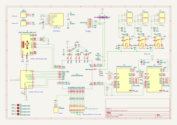
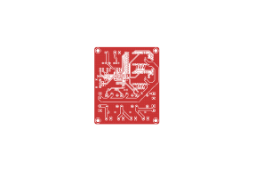
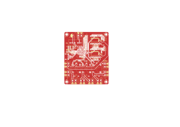
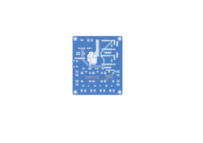
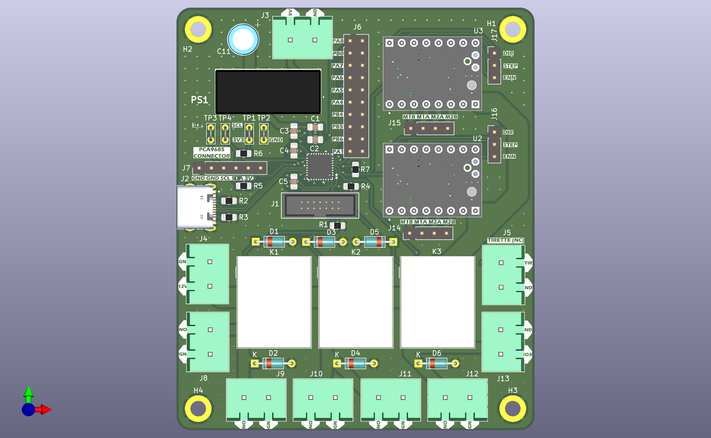
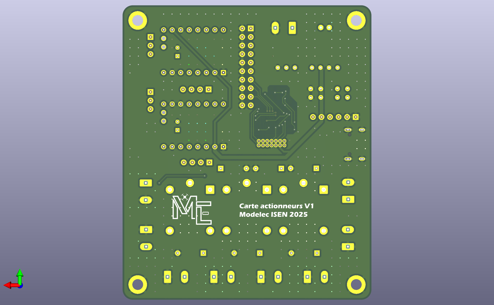
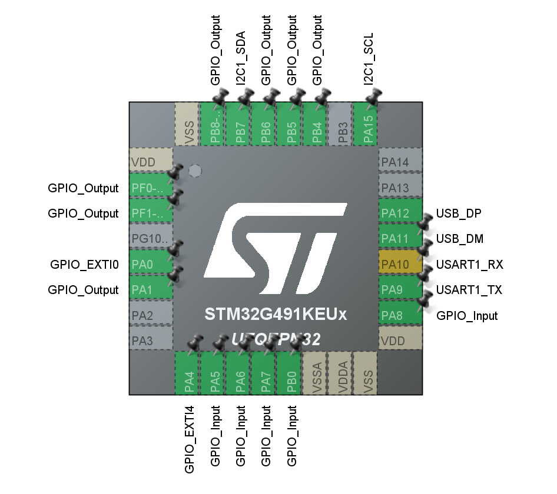

# PCB Actionneurs

## Introduction
Le PCB actionneurs 2025 du robot pilote des servomoteurs et leds via PCA9685, héberge 3 relais indépendants et propose des I/Os, notamment pour la tirette de démarrage du robot.

Les fonctionnalités proposées sont :
- Pilotage de 3 sorties 12V (indépendantes) via relais
- Connecteur pour la tirette
- Connecteur pour un PCA9685 + son alim
- GPIOs supplémentaires
## Besoins
Les besoins qui nous ont amené à réaliser un PCB actionneur pour le robot sont :
- Réduction du câblage
- Réduction de l'encombrement
- Déport/compartimentation du contrôle des actionneurs pour soulager la raspberry pi 
## Spécifications
Le PCB actionneurs a été réalisé dans le but d'implémenter les spécifications suivantes :
<tabs>
<tab title="Sources">

- Le PCB actionneurs doit être alimenté en 5V contrôlé par BAU.
- Le PCB actionneurs doit avoir une seule entrée 12V capable d'alimenter 3 relais et le PCA9685.
</tab>
<tab title="Fonctionnalités">

- Le PCB actionneurs doit héberger 3 relais et protéger ces 3 relais avec diodes de roue libre.
</tab>
<tab title="Connecteur PCA9685">

- Le PCB doit contenir un connecteur type Dupont femelle 1,27mm 6 points.
- Le connecteur PCA9685 permet l'alimentation (3V3, GND) et le pilotage I2C du PCA9685.
- Le connecteur PCA9685 respecte la même attribution des pins que sur le PCA9685 (GND, OE, SCL, SDA, VCC, V+).
- OE (Output Enable) doit être à la masse en permanence.
- V+ (Alimentation des sorties) doit être non connecté, car un autre connecteur avec une plus grande capacité est utilisé.
- VCC doit être à 3V3 en permanence.
</tab>
<tab title="Connecteurs moteurs pas à pas & TMC2209">

- Le PCB doit avoir deux connecteurs TMC2209 et les sorties pour piloter les moteurs correspondantes.
</tab>
<tab title="Communication raspi">

- Le PCB doit communiquer avec la raspberrypi via un port USB-C.
- La communication avec la raspberrypi doit se faire telle que décrite en page .
</tab>
<tab title="Autres connecteurs">

- Le PCB doit avoir deux sorties NO (Normally Open) pour chaque relais, protégées par diodes de roue libre.
- Chaque sortie NO doit être capable de soutenir un courant de ...A à 12V.
- Une sortie en connecteur à vis doit être connectée à un GPIO pour la tirette.
- Le reste des GPIOs non utilisés doivent être exposés sur un connecteur Dupont 1,27mm.
</tab>
</tabs>

## Schéma électrique
{ width="800" }

Documentations :
- [TMR 6-0510](https://tracopower.com/tmr6-datasheet/)
- TMC2209 : [BigTreeTech (module complet)](https://bttwiki.com/TMC2209.html), [Analog (composant intégré)](https://www.analog.com/media/en/technical-documentation/data-sheets/TMC2209_datasheet_rev1.09.pdf)

## Routage
### Couche supérieure
{ width="800" }
{ width="800" }
### Couche inférieure
{ width="800" }
{ width="800" }
### Perçage
{ width="800" }
## Vues 3D
### Vue de dessus
{ width="800" }
### Vue de dessous
{ width="800" }

## Configuration pins STM32
### IOC

### Tirette
- PA0
### Relais

### TMC2209

## Erreurs et corrections
### PB8 - Pilotage des relais
#### PB8 - Remarques
- Un seul pin est utilisé pour piloter tous les relais.
- Il faut utiliser 3 pins, chacun pour un relai.
#### J2 - Consequences
- En présence de ce défaut, les relais ne peuvent pas être pilotés séparément
#### J2 - Etat de correction
- Correction physique sur la carte dans le robot : ✅
- Correction sur le schéma KiCad : ❌