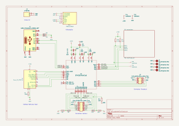

# PCB Odométrie
Mis à jour pour la version [v1](https://github.com/modelec/pcbs_modelec/releases/tag/odo-v1) commandée le 28 mars 2025.

## Introduction
Le PCB odométrie 2025 du robot pilote les moteurs en position et reçoit les mesures des encodeurs.

La release concernée par cette documentation est ici : [Release](https://github.com/modelec/pcbs_modelec/releases/tag/odo-v1)

Les fonctionnalités proposées sont :
- Pilotage des 2 moteurs CC via PWM avec PCB pluggable sur le driver DBH-12V.
- Lecture des mesures des 2 encodeurs.
- Lecture des mesures de 8 capteurs ToF.
- Gestion de l'odométrie et du suivi de trajectoire avec PID codé dans le microcontrôleur.
- Communication USB avec la rasp
## Besoins
Les besoins qui nous ont amené à réaliser un PCB odométrie pour le robot sont :
- Réduction du câblage
- Réduction de l'encombrement
- Microcontrôleur plus rapide et dédié pour le PID
## Spécifications
Le PCB odométrie a été réalisé dans le but d'implémenter les spécifications suivantes :
<tabs>
<tab title="Sources">

- Le PCB odométrie doit être alimenté en 5V contrôlé par BAU.
- Le PCB odométrie doit permettre de faire passer le 12V des moteurs vers l'alim des encodeurs.
</tab>
<tab title="Connecteur encodeurs">

- Le PCB doit contenir un connecteur permettant de recevoir les signaux de deux encodeurs.
- Les encodeurs utilisés sont alimentés en 12V et envoient chacun deux signaux en quadrature en collecteur ouvert.
 (La documentation des encodeur est disponible sur le sharepoint de l'équipe)
</tab>
<tab title="Connecteur hacheur">

- Le PCB doit avoir un connecteur adapté au hacheur DBH-12V.
- Le connecteur Hacheur doit alimenter le PCB en 12V via deux pins V+.
- Le connecteur Hacheur doit permettre l'envoi de signaux PWM via les pins IN1A, IN2A, IN1B, IN2B.
- Le connecteur Hacheur doit permettre la lecture d'un signal analogique de mesure du courant compris entre 0 et 12V via les deux pins CT.
- Le connecteur Hacheur doit permettre de plugger directement le PCB sur le hacheur pour limiter l'encombrement du total.
</tab>
<tab title="Communication raspi">

- Le PCB doit communiquer avec la raspberrypi via un port USB-C.
- La communication avec la raspberrypi doit se faire telle que décrite en page .
</tab>
</tabs>

## Schéma électrique
### Architecture générale
{ width="800" }

Documentations :
- [TMR 6-0510](https://tracopower.com/tmr6-datasheet/)
### Sous-partie connecteurs ToF
{ width="800" }

## Routage
### Couche supérieure
{ width="800" }
{ width="800" }
### Couches intermédiaires
{ width="800" }
{ width="800" }
### Couche inférieure
{ width="800" }
{ width="800" }
### Perçage
{ width="800" }
## Vues 3D
### Vue de dessus
{ width="800" }
### Vue de dessous
{ width="800" }

## Configuration pins STM32
### IOC

### Moteur A
- IN1A => TIM8 - CH1 (PB6)
- IN2A => TIM8 - CH2 (PB8)
### Moteur B
- IN1B => TIM1  - CH1 (PA8)
- IN2B => TIM1 - CH2 (PA9)
### Encodeur 1
- TIM3 - CH1 (PB4)
- TIM3 - CH2 (PA4)
### Encodeur 2
- TIM2 - CH1 (PA0)
- TIM2 - CH2 (PA1)

## Erreurs et corrections
### J2
#### J2 - Remarques
- J2 est à l'envers sur le schéma. Il doit être soudé sur la face supérieure avec son détrompeur vers le bas de la carte.
- Le 3V3 de J2 n'est pas relié. Il faut ajouter une connexion entre le 3V3 de J2 et le 3V3 de PS1.
#### J2 - Consequences
- En présence de ces défauts, le STM32 ne peut pas être flashé ou débuggé avec un STLINK.
#### J2 - Etat de correction
- Correction physique sur la carte dans le robot : ✅
- Correction sur le schéma KiCad : ✅