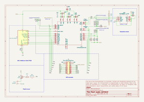
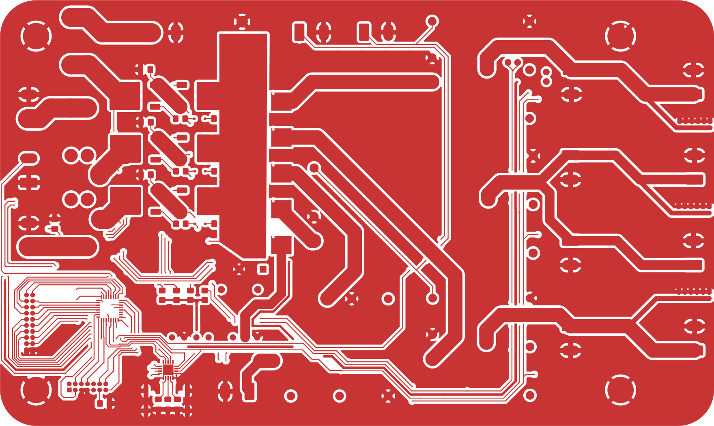
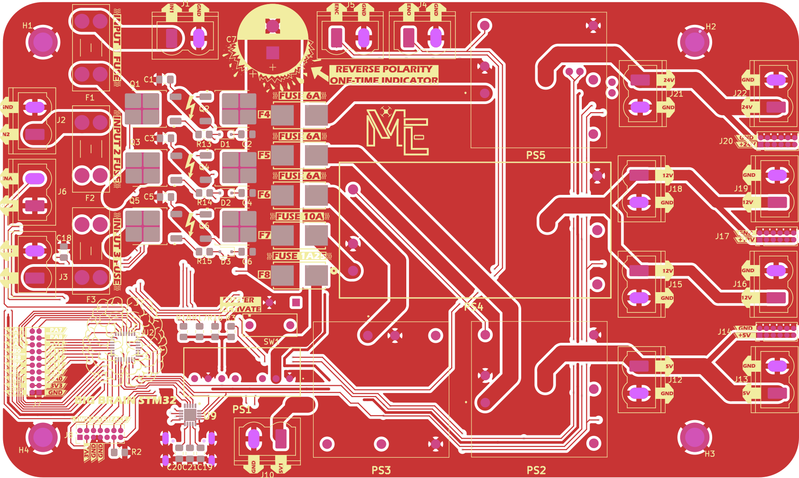
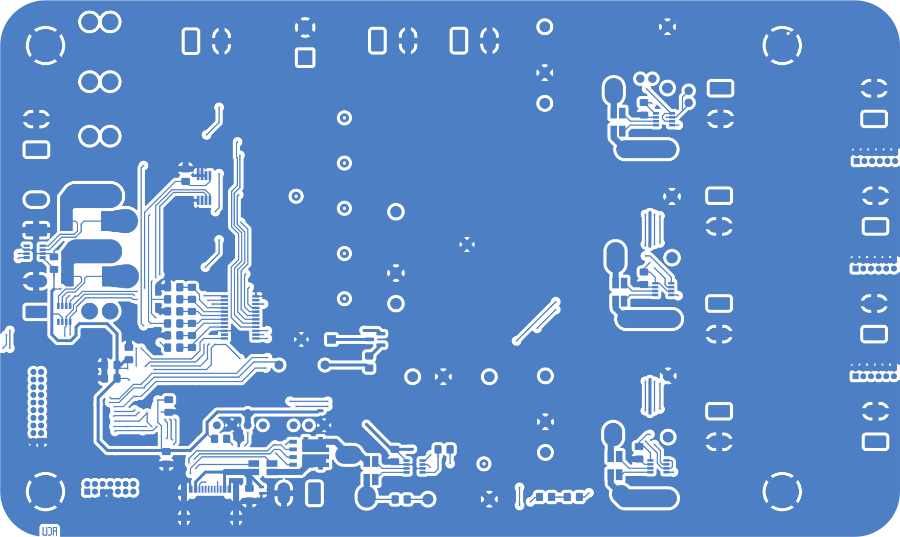
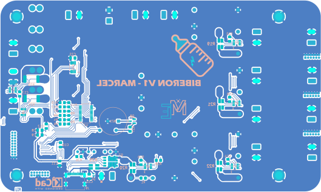
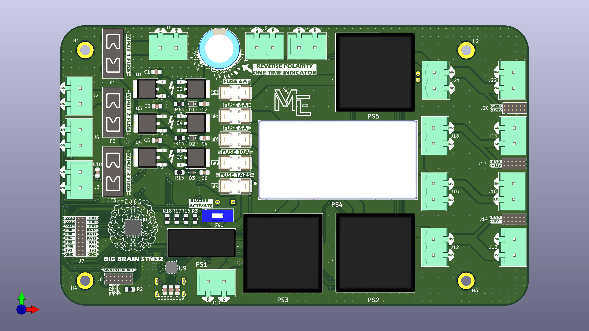
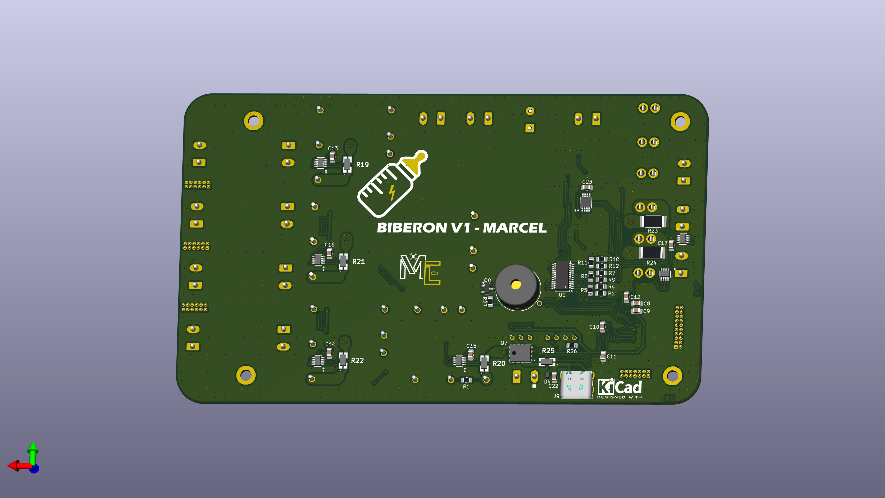

# PCB alimentation
## Introduction
Le PCB alimentation 2025 du robot fait le lien entre les différentes sources d'alimentation et les composants du robot.

La release concernée par cette documentation est ici https://github.com/modelec/pcb_puissance/releases/tag/v2-alpha

Les fonctionnalités proposées sont :
- Jusqu'à 3 sources, hot-pluggable
- Protection contre les reverse voltages en entrée
- Sélection de la meilleure source, protection contre under et overvoltage
- Coupe circuit général et arrêt d'urgence uniquement sur certaines sorties
- Mesures de tension/courant/puissances sur chaque sortie
- Mesure du taux de charge des batteries connectées
- Mesure de la température de la carte
- Protocole USB-PD sur la sortie 5,15V
- Remontée d'info & GPIO
## Besoins
Les besoins qui nous ont amené à réaliser un PCB alimentation pour le robot sont :
- Réduction du câblage
- Coupe circuit général
- Coupe circuit ciblé sur appui bouton d'arrêt d'urgence
- Plusieurs tensions d'alimentation différentes selon les composants
- Capacité d'alimenter le robot sur secteur ET/OU sur batterie
## Spécifications
Le PCB alimentation a été réalisé dans le but d'implémenter les spécifications suivantes :
<tabs>
<tab title="Sources">

- Le PCB doit accepter au moins deux sources de puissance.
- Le passage d'une source à l'autre ne doit pas engendrer de chute de tension risquant de faire redémarrer la raspberrypi.
- Au moins une des sources d'alimentation doit être destinée au secteur.
- La source d'alimentation destinée au secteur doit accepter des tensions de 12V et 24V.
- Au moins une des sources d'alimentation doit être destinée à une batterie.
- La source d'alimentation destinée à une batterie doit accepter une tension entre 11,1V et 13V.
- Les sources d'alimentation doivent permettre un courant d'alimentation de 16A.
</tab>
<tab title="Respect du rêglement">

- Le PCB doit permettre de connecter un bouton d'arrêt d'urgence en NC et en NO.
- L'appui sur le bouton d'arrêt d'urgence doit provoquer la coupure des sorties spécifiées, de manière immédiate.
- Les tensions doivent rester entre les bornes -48v et 48V.
</tab>
<tab title="Sorties 5V">

- Le PCB doit générer une sortie avec une tension de 5V +-10%.
- La sortie 5V du PCB doit avoir une puissance supérieure à 25W.
- La sortie 5V doit proposer au moins deux connecteurs permettant un courant de 5A.
- La sortie 5V doit proposer des connecteurs mâles Dupont pour des connexions faciles.
- La sortie 5V doit être coupée immédiatement quand le bouton d'arrêt d'urgence est enfoncé.
</tab>
<tab title="Sorties 5,15V">

- Le PCB doit générer une sortie avec une tension de 5,15V +-1%.
- La sortie 5,15V du PCB doit avoir une puissance supérieure à 40W.
- La sortie 5,15V doit proposer au moins un connecteur permettant un courant de 5A.
- La sortie 5,15V doit proposer au moins un connecteur USB type C.
- La sortie 12V doit **rester active** quand le bouton d'arrêt d'urgence est enfoncé.
</tab>
<tab title="Sorties 12V">

- Le PCB doit générer une sortie avec une tension de 12V +-1%.
- La sortie 12V du PCB doit avoir une puissance supérieure à 40W.
- La sortie 12V doit proposer au moins deux connecteurs permettant un courant de 5A.
- La sortie 12V doit proposer des connecteurs mâles Dupont pour des connexions faciles.
- La sortie 12V doit être coupée immédiatement quand le bouton d'arrêt d'urgence est enfoncé.
</tab>
<tab title="Sorties 24V">

- Le PCB doit générer une sortie avec une tension de 24V +-1%.
- La sortie 24V du PCB doit avoir une puissance supérieure à 25W.
- La sortie 24V doit proposer au moins deux connecteurs permettant un courant de 2A.
- La sortie 24V doit proposer des connecteurs mâles Dupont pour des connexions faciles.
- La sortie 24V doit être coupée immédiatement quand le bouton d'arrêt d'urgence est enfoncé.
</tab>
<tab title="Sécurités">

- La prise en compte de l'appui sur le bouton d'arrêt d'urgence ne doit pas passer par un programme pour éviter l'aléa d'un bug.
- Le PCB doit proposer un connecteur pour implémenter la fonction de coupe circuit général.
- Le PCB doit être robuste aux polarités inverses en entrée.
- Le PCB doit être robuste aux courts circuits en sortie.
- Le PCB doit avoir des protections contre les surchauffes.
- Le PCB doit permettre de protéger chaque entrée par un fusible.
- Le PCB doit détecter un taux de charge trop faible sur une batterie et la déconnecter.
</tab>
<tab title="Fonctionnalités avancées">

- Le PCB doit permettre de mesurer la tension et le courant en temps réel sur les sorties.
- La sortie 5,15V doit implémenter le protocole Power Delivery sur le connecteur USB-C pour les paramètres suivants : 5,15V 3A et 5,15V 5A.
- Le PCB doit pouvoir faire de la remontée d'information à la RaspberryPi via un protocole série (I2C, SPI ou UART).
- Le PCB doit être capable de mesurer et faire remonter le taux de charge des batteries en fonction de la tension et du courant mesuré en sortie de la batterie.
- Le PCB doit remonter la source d'alimentation active et les sources d'alimentation valides.
- Le PCB doit émettre un signal sonore au changement de source d'alimentation.
- Le PCB doit émettre un signal sonore différent si une batterie est déchargée.
</tab>
<tab title="Encombrement">

- L'encombrement de la carte d'alimentation doit être minimisé au maximum.
- La largeur ne peut en aucun cas dépasser 90mm.
- La longueur ne peut en aucun cas dépasser 290mm.
- La carte doit avoir au moins 4 trous de fixation M5.
- Les composants sur la face inférieure ne peuvent pas dépasser 20mm de hauteur.
- Aucun connecteur ne peut être dirigé vers le dessous de la carte.
</tab>
</tabs>

## Schéma électrique
### Principe général
{ width="800" }
Ce schéma expose le principe général des circuits présents sur la carte.
- 3 entrées (une pour secteur et deux pour batteries LiPo3S)
- Fusibles en entrée et avant chaque convertisseur de tension traco power
- Mesure de courant/tension
- Mesure de température
- USB-PD, buzzer, STM32, coupe circuit
- Boutons d'arrêt d'urgence sur les convertisseurs concernés.
### Architecture générale
{ width="800" }
De gauche à droite:
- 3 entrées d'alimentation
- Entrée coupe circuit (EN) en Normally Open
- Entrées bouton d'arrêt d'urgence en Normally Open et Normally Closed
- Convertisseurs de tension
- Trous de montage
### Sous-partie sélection de la tension d'entrée
{ width="800" }
De gauche à droite:
- Mesure de courant/tension sur les deux entrée destinées aux batteries
- Résistances pour régler les seuils d'overvoltage et d'undervoltage (voir documentation du LTC4417)
- P-MOSFETs pour sélectionner une des trois entrées à la fois + limitation du courant d'appel

Documentations : 
- [LTC4417](https://www.analog.com/media/en/technical-documentation/data-sheets/ltc4417.pdf)

Concepteur avec paramètres utilisés : [tools.analog.com](https://tools.analog.com/en/toolbox/LTC4417/#vin_v1=22&tol_v1=45&vin_v2=13&tol_v2=5&vin_v3=13&tol_v3=5&uv_v1=10&ov_v1=35&uv_v2=11.15&ov_v2=35&uv_v3=11.15&ov_v3=35&hys_config=int&idiv=10&rsource_v2=0.03&rsource_v3=0.03&fet_selection=SUD50P06-15&fet_selection_ch2=SUD50P06-15&fet_selection_ch3=SUD50P06-15&rsource_v1=0.03&esr=0.018&rds_on=20&rds_on_ch2=20&rds_on_ch3=20&use_custom_fet=false&vdroop_supply=1&vdroop_out=0.5&iload=10&inrush_target=10&inrush_target_ch2=10&inrush_target_ch3=10&cout_act=1000&use_std_inrush=true&topology_ch1=3rt&use_std_ch1=true&topology_ch2=3rt&use_std_ch2=true&topology_ch3=3rt&use_std_ch3=true)
### Sous-partie sorties
{ width="800" }
Mesure de courant/tension pour chaque zone. Controlleur USB-PD supplémentaire pour la sortie 5,15V.

Documentations : 
- [INA236](https://www.ti.com/lit/ds/symlink/ina236.pdf)
- [TCPP02-M18](https://www.st.com/resource/en/datasheet/tcpp02-m18.pdf)
- [Résistances L4CL](https://www.littelfuse.com/assetdocs/littelfuse_resistor_l4cl_datasheet.pdf?assetguid=705ee59d-6d7d-4586-a1c9-d4fd20ab4969)
### Sous-partie microcontrolleur
{ width="800" }
De gauche à droite:
- Connecteur SWD pour flasher le STM32
- Buzzer
- Connecteur GPIO
- Capteur de température

Documentations :
- [STM32G419](https://www.st.com/resource/en/datasheet/stm32g491ke.pdf)
- [MCP9608T](https://ww1.microchip.com/downloads/aemDocuments/documents/OTH/ProductDocuments/DataSheets/MCP9808-0.5C-Maximum-Accuracy-Digital-Temperature-Sensor-Data-Sheet-DS20005095B.pdf)

## Routage
### Couche supérieure
{ width="800" }
{ width="800" }
### Couche inférieure
{ width="800" }
{ width="800" }
## Vues 3D
### Vue de dessus
{ width="800" }
### Vue de dessous
{ width="800" }
