# PCB alimentation
Mis à jour pour la version [v2-beta](https://github.com/modelec/pcb_puissance/releases/tag/v2-beta)

## Introduction
Le PCB alimentation 2025 du robot fait le lien entre les différentes sources d'alimentation et les composants du robot.

La release concernée par cette documentation est ici : [Release](https://github.com/modelec/pcb_puissance/releases/tag/v2-beta)

Les fonctionnalités proposées sont :
- Jusqu'à 3 sources, hot-pluggable
- Chute de tension limitée lors du changement de source
- Protection contre les tension inverses en entrée
- Sélection de la meilleure source, protection contre sur et sous tensions
- Coupe circuit général et arrêt d'urgence uniquement sur certaines sorties
- Convertisseurs de tension désactivés par défaut, pilotés par STM32
- Mesures de tension/courant/puissances sur chaque sortie
- Mesure du taux de charge des batteries connectées
- Mesure de la température de la carte
- Protocole USB-PD sur la sortie 5,15V
- Remontée d'info, GPIOs, STM32 programmable et débugable via SWD
- Buzzer désactivable via un switch
## Besoins
Les besoins qui nous ont amené à réaliser un PCB alimentation pour le robot sont :
- Réduction du câblage
- Coupe circuit général
- Coupe circuit ciblé sur appui bouton d'arrêt d'urgence
- Plusieurs tensions d'alimentation différentes selon les composants
- Capacité d'alimenter le robot sur secteur ET/OU sur batterie
## Spécifications
Le PCB alimentation a été réalisé dans le but d'implémenter les spécifications suivantes :
<tabs>
<tab title="Sources">

- Le PCB doit accepter au moins deux sources de puissance.
- Le passage d'une source à l'autre ne doit pas engendrer de chute de tension risquant de faire redémarrer la raspberrypi.
- Au moins une des sources d'alimentation doit être destinée au secteur.
- La source d'alimentation destinée au secteur doit accepter des tensions de 12V et 24V.
- Au moins une des sources d'alimentation doit être destinée à une batterie.
- La source d'alimentation destinée à une batterie doit accepter une tension entre 11,1V et 13V.
- Les sources d'alimentation doivent permettre un courant d'alimentation de 16A.
</tab>
<tab title="Respect du rêglement">

- Le PCB doit permettre de connecter un bouton d'arrêt d'urgence en NC et en NO.
- L'appui sur le bouton d'arrêt d'urgence doit provoquer la coupure des sorties spécifiées, de manière immédiate.
- Les tensions doivent rester entre les bornes -48v et 48V.
</tab>
<tab title="Sorties 5V">

- Le PCB doit générer une sortie avec une tension de 5V +-10%.
- La sortie 5V du PCB doit avoir une puissance supérieure à 25W.
- La sortie 5V doit proposer au moins deux connecteurs permettant un courant de 5A.
- La sortie 5V doit proposer des connecteurs mâles Dupont pour des connexions faciles.
- La sortie 5V doit être coupée immédiatement quand le bouton d'arrêt d'urgence est enfoncé.
</tab>
<tab title="Sorties 5,15V">

- Le PCB doit générer une sortie avec une tension de 5,15V +-1%.
- La sortie 5,15V du PCB doit avoir une puissance supérieure à 40W.
- La sortie 5,15V doit proposer au moins un connecteur permettant un courant de 5A.
- La sortie 5,15V doit proposer au moins un connecteur USB type C.
- La sortie 12V doit **rester active** quand le bouton d'arrêt d'urgence est enfoncé.
</tab>
<tab title="Sorties 12V">

- Le PCB doit générer une sortie avec une tension de 12V +-1%.
- La sortie 12V du PCB doit avoir une puissance supérieure à 40W.
- La sortie 12V doit proposer au moins deux connecteurs permettant un courant de 5A.
- La sortie 12V doit proposer des connecteurs mâles Dupont pour des connexions faciles.
- La sortie 12V doit être coupée immédiatement quand le bouton d'arrêt d'urgence est enfoncé.
</tab>
<tab title="Sorties 24V">

- Le PCB doit générer une sortie avec une tension de 24V +-1%.
- La sortie 24V du PCB doit avoir une puissance supérieure à 25W.
- La sortie 24V doit proposer au moins deux connecteurs permettant un courant de 2A.
- La sortie 24V doit proposer des connecteurs mâles Dupont pour des connexions faciles.
- La sortie 24V doit être coupée immédiatement quand le bouton d'arrêt d'urgence est enfoncé.
</tab>
<tab title="Sécurités">

- La prise en compte de l'appui sur le bouton d'arrêt d'urgence ne doit pas passer par un programme pour éviter l'aléa d'un bug.
- Le PCB doit proposer un connecteur pour implémenter la fonction de coupe circuit général.
- Le PCB doit être robuste aux polarités inverses en entrée.
- Le PCB doit être robuste aux courts circuits en sortie.
- Le PCB doit avoir des protections contre les surchauffes.
- Le PCB doit permettre de protéger chaque entrée par un fusible.
- Le PCB doit détecter un taux de charge trop faible sur une batterie et la déconnecter.
</tab>
<tab title="Fonctionnalités avancées">

- Le PCB doit permettre de mesurer la tension et le courant en temps réel sur les sorties.
- La sortie 5,15V doit implémenter le protocole Power Delivery sur le connecteur USB-C pour les paramètres suivants : 5,15V 3A et 5,15V 5A.
- Le PCB doit pouvoir faire de la remontée d'information à la RaspberryPi via un protocole série (I2C, SPI ou UART).
- Le PCB doit être capable de mesurer et faire remonter le taux de charge des batteries en fonction de la tension et du courant mesuré en sortie de la batterie.
- Le PCB doit remonter la source d'alimentation active et les sources d'alimentation valides.
- Le PCB doit émettre un signal sonore au changement de source d'alimentation.
- Le PCB doit émettre un signal sonore différent si une batterie est déchargée.
</tab>
<tab title="Encombrement">

- L'encombrement de la carte d'alimentation doit être minimisé au maximum.
- La largeur ne peut en aucun cas dépasser 90mm.
- La longueur ne peut en aucun cas dépasser 290mm.
- La carte doit avoir au moins 4 trous de fixation M5.
- Les composants sur la face inférieure ne peuvent pas dépasser 20mm de hauteur.
- Aucun connecteur ne peut être dirigé vers le dessous de la carte.
</tab>
</tabs>

## Schéma électrique
### Principe général
{ width="800" }
Ce schéma expose le principe général des circuits présents sur la carte.
- 3 entrées (une pour secteur et deux pour batteries LiPo3S)
- Fusibles en entrée et avant chaque convertisseur de tension traco power
- Mesure de courant/tension
- Mesure de température
- USB-PD, buzzer, STM32, coupe circuit
- Boutons d'arrêt d'urgence sur les convertisseurs concernés.
### Architecture générale
{ width="800" }
De gauche à droite:
- 3 entrées d'alimentation
- Entrée coupe circuit (EN) en Normally Open
- Entrées bouton d'arrêt d'urgence en Normally Open et Normally Closed
- Convertisseurs de tension
- Trous de montage
### Sous-partie sélection de la tension d'entrée
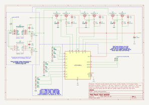{ width="800" }
De gauche à droite:
- Mesure de courant/tension sur les deux entrée destinées aux batteries
- Résistances pour régler les seuils d'overvoltage et d'undervoltage (voir documentation du LTC4417)
- P-MOSFETs pour sélectionner une des trois entrées à la fois + limitation du courant d'appel

Documentations : 
- [LTC4417](https://www.analog.com/media/en/technical-documentation/data-sheets/ltc4417.pdf)

Concepteur avec paramètres utilisés : [tools.analog.com](https://tools.analog.com/en/toolbox/LTC4417/#vin_v1=22&tol_v1=45&vin_v2=13&tol_v2=5&vin_v3=13&tol_v3=5&uv_v1=10&ov_v1=35&uv_v2=11.15&ov_v2=35&uv_v3=11.15&ov_v3=35&hys_config=int&idiv=10&rsource_v2=0.03&rsource_v3=0.03&fet_selection=SUD50P06-15&fet_selection_ch2=SUD50P06-15&fet_selection_ch3=SUD50P06-15&rsource_v1=0.03&esr=0.018&rds_on=20&rds_on_ch2=20&rds_on_ch3=20&use_custom_fet=false&vdroop_supply=1&vdroop_out=0.5&iload=10&inrush_target=10&inrush_target_ch2=10&inrush_target_ch3=10&cout_act=1000&use_std_inrush=true&topology_ch1=3rt&use_std_ch1=true&topology_ch2=3rt&use_std_ch2=true&topology_ch3=3rt&use_std_ch3=true)
### Sous-partie microcontrolleur
{ width="800" }
De gauche à droite:
- Connecteur SWD pour flasher le STM32
- Buzzer
- Connecteur GPIO
- Capteur de température

Documentations :
- [STM32G419](https://www.st.com/resource/en/datasheet/stm32g491ke.pdf)
- [MCP9608T](https://ww1.microchip.com/downloads/aemDocuments/documents/OTH/ProductDocuments/DataSheets/MCP9808-0.5C-Maximum-Accuracy-Digital-Temperature-Sensor-Data-Sheet-DS20005095B.pdf)
### Sous-partie sorties
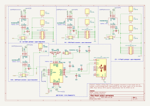{ width="800" }
Mesure de courant/tension pour chaque zone. Controlleur USB-PD supplémentaire pour la sortie 5,15V.

Documentations :
- [INA236](https://www.ti.com/lit/ds/symlink/ina236.pdf)
- [TCPP02-M18](https://www.st.com/resource/en/datasheet/tcpp02-m18.pdf)
- [Résistances L4CL](https://www.littelfuse.com/assetdocs/littelfuse_resistor_l4cl_datasheet.pdf?assetguid=705ee59d-6d7d-4586-a1c9-d4fd20ab4969)
## Routage
### Couche supérieure
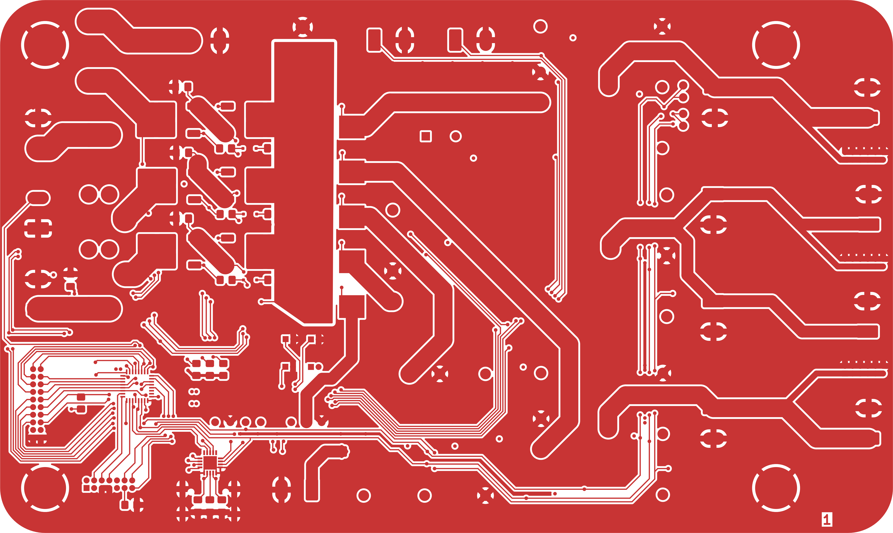{ width="800" }
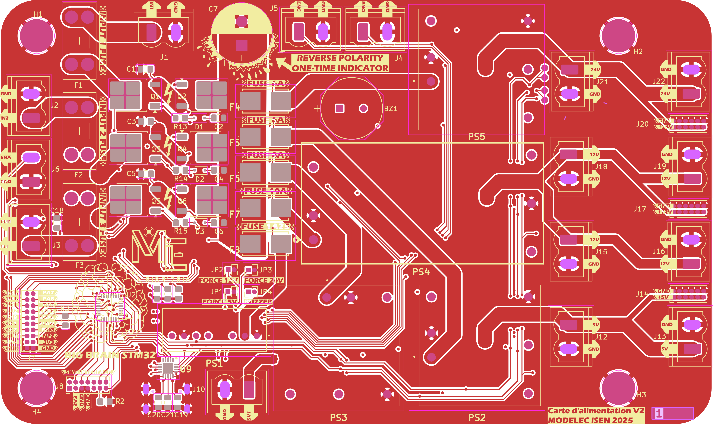{ width="800" }
### Couches intermédiaires
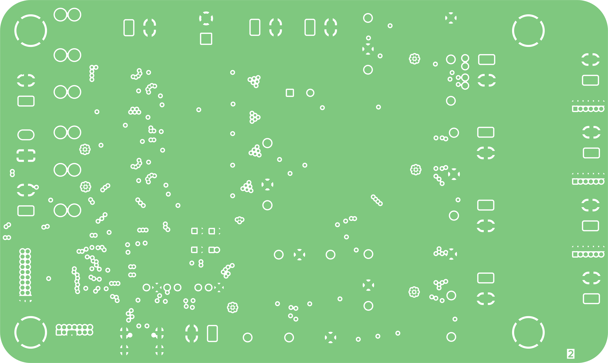{ width="800" }
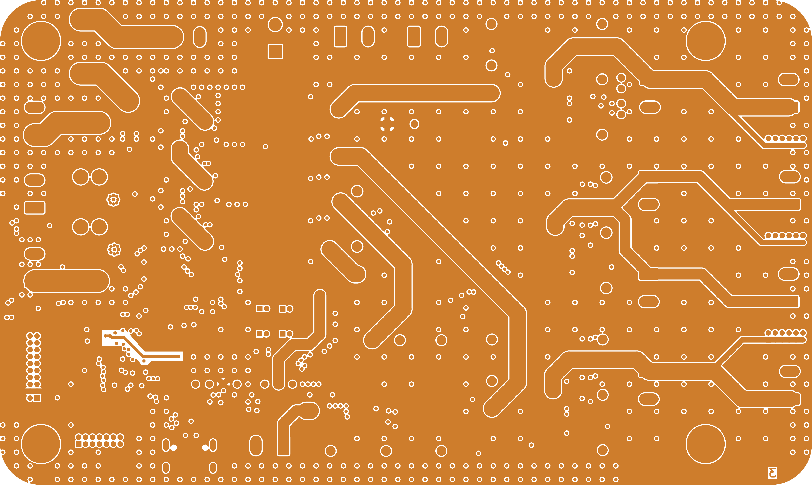{ width="800" }
### Couche inférieure
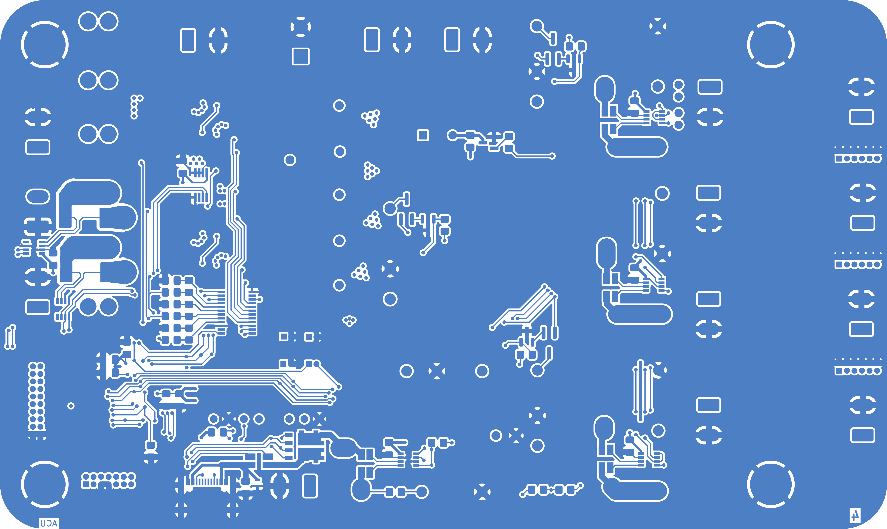{ width="800" }
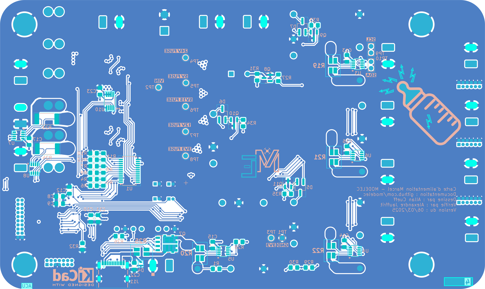{ width="800" }
### Perçage
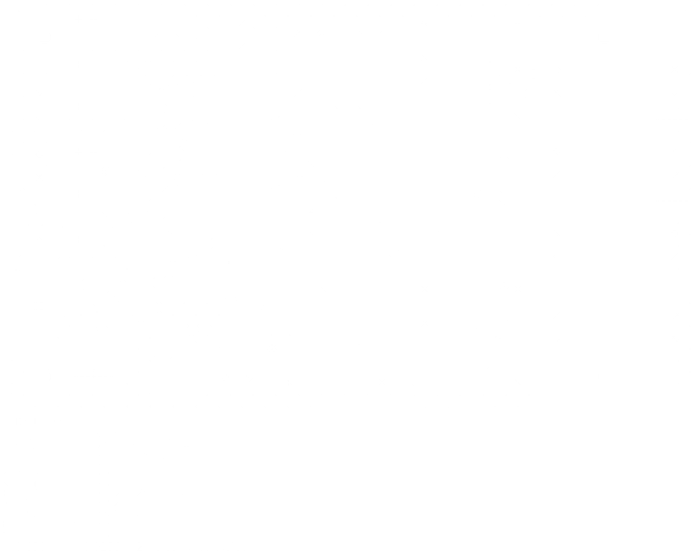{ width="800" }
## Vues 3D
### Vue de dessus
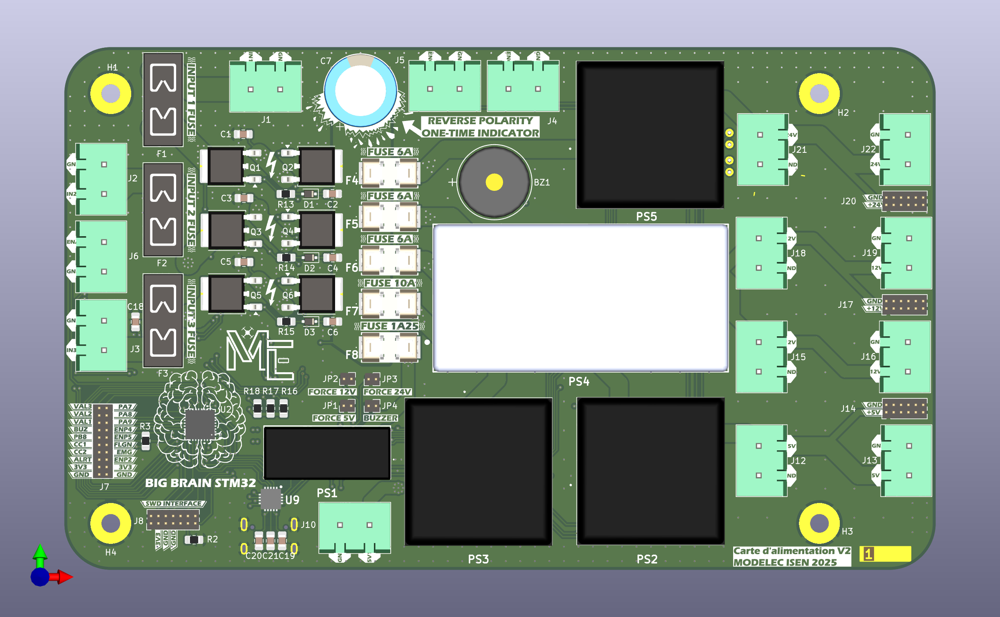{ width="800" }
### Vue de dessous
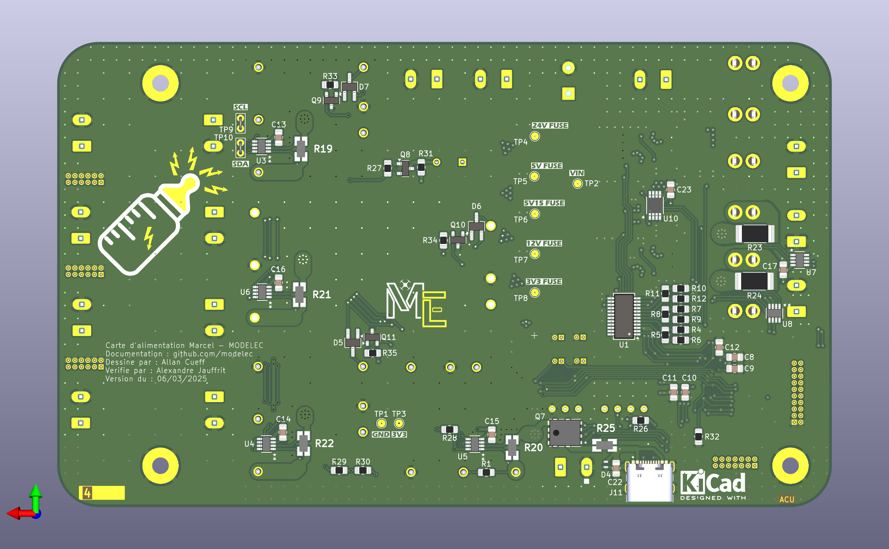{ width="800" }

## Qualité
### Règles de design appliquées
#### Largeur des pistes
| 0,2mm                                                                  | 0,5mm                                                                          | 1mm                                                                                  | 2mm                  | 3mm                                                                                                                               | 4mm                       |
|------------------------------------------------------------------------|--------------------------------------------------------------------------------|--------------------------------------------------------------------------------------|----------------------|-----------------------------------------------------------------------------------------------------------------------------------|---------------------------|
| GPIO, I2C, VALID, OV, UV, Resistances mesure de courant, Gates mosfets | 3,3V, Pads des résistances de mesure de courant, Pads VBUS du connecteur USB-C | Alimentation connecteur USB-C, Alimentation des 6 pins Dupont en sortie de puissance | Vout vers Traco 3,3V | Sources communes des P-MOSFET de puissance, F4, F5, F6, F7, F8, Sorties des Traco => resistances de mesure => connecteurs Phoenix | IN1, IN2, IN3, F1, F2, F3 |

#### Règles de design
| Regle                         | Valeur | Violation                            |
|-------------------------------|--------|--------------------------------------|
| Isolation minimum             | 0,2mm  | Pads STM32, Pads TCPP02, Pads INA236 |
| Largeur de piste minimum      | 0,2mm  | non                                  |
| Largeur minimale de connexion | 0,02mm | non                                  |
| Largeur minimale d'anneau     | 0,1mm  | non                                  |
| Diamètre minimum de via       | 0,5mmm | non                                  |
| Isolation trou/cuivre         | 0,25mm | Trou non métallisé connecteur USB-C  |
|  Isolation cuivre/contour     | 0,5mm  | non                                  |

### Bonnes pratiques
- SDA et SCL séparées par une piste GND ou 3V3 quand c'est possible.
- Plans de masse sur les quatre faces avec matrice de vias de 5mm et 2,5mm sur les bordures.
- Pistes à courant important doublées sur les faces intermédiaires

### Vérifications réalisées

- Schéma électrique pour la sélection d'entrée conforme à celui recommandé dans la datasheet du LTC4417.
- Schéma électrique pour l'USB-PD conforme à celui dans la datasheet de la carte d'évaluation X-NUCLEO-SRC1M1.
- GPIO du STM32 bien choisis par fonction pour SDA, SLC, PWM du buzzer, CC1, CC2.
- Condensateurs de découplages présents et conformes aux recommendations des datasheets STM32G419, TCPP02, INA236 et MCP9608.
- Résistances de pull-up et capacitance totale du bus I2C conformes au [standard](https://www.nxp.com/docs/en/user-guide/UM10204.pdf).
- Plusieurs chemins de retour pour la masse, suffisamment larges et aménagés avec des vias.
- Références des empreintes visibles et toutes orientées de la même manière.
- Espace suffisamment important autour des connecteurs.
- Indications utilisateur utiles ajoutées pour les fusibles, test points, switches, connecteurs.

## Fabrication
### Fichiers de fabrication
Les fichiers sources KiCad et les fichiers de fabrication sont téléchargeables dans les [releases Github](https://github.com/modelec/pcb_puissance/releases)
### Bill Of Material
| Reference                                 | Value                                                                                                                                                                                              | Description                                                                                                                                                                                                                                                                                                                                                                                                                                                                                       |
|-------------------------------------------|----------------------------------------------------------------------------------------------------------------------------------------------------------------------------------------------------|---------------------------------------------------------------------------------------------------------------------------------------------------------------------------------------------------------------------------------------------------------------------------------------------------------------------------------------------------------------------------------------------------------------------------------------------------------------------------------------------------|
| BZ1                                       | [Buzzer](https://product.tdk.com/en/system/files/dam/doc/product/sw_piezo/sw_piezo/piezo-buzzer/catalog/piezoelectronic_buzzer_ps_en.pdf)                                                          | Buzzer, polarized                                                                                                                                                                                                                                                                                                                                                                                                                                                                                 |
| C1,C3,C5                                  | 0u4                                                                                                                                                                                                | Unpolarized capacitor                                                                                                                                                                                                                                                                                                                                                                                                                                                                             |
| C2,C4,C6                                  | 40n                                                                                                                                                                                                | Unpolarized capacitor                                                                                                                                                                                                                                                                                                                                                                                                                                                                             |
| C7                                        | [1000u](https://www.nichicon.co.jp/english/series_items/catalog_pdf/e-uvy.pdf)                                                                                                                     | Polarized capacitor                                                                                                                                                                                                                                                                                                                                                                                                                                                                               |
| C8                                        | 10n                                                                                                                                                                                                | Unpolarized capacitor                                                                                                                                                                                                                                                                                                                                                                                                                                                                             |
| C9,C10,C13,C18,C21,C23                    | 100n                                                                                                                                                                                               | Unpolarized capacitor                                                                                                                                                                                                                                                                                                                                                                                                                                                                             |
| C11                                       | 4u7                                                                                                                                                                                                | Unpolarized capacitor                                                                                                                                                                                                                                                                                                                                                                                                                                                                             |
| C12                                       | 1u                                                                                                                                                                                                 | Unpolarized capacitor                                                                                                                                                                                                                                                                                                                                                                                                                                                                             |
| C19,C20                                   | 330u                                                                                                                                                                                               | Unpolarized capacitor                                                                                                                                                                                                                                                                                                                                                                                                                                                                             |
| C22                                       | 2u2                                                                                                                                                                                                | Unpolarized capacitor                                                                                                                                                                                                                                                                                                                                                                                                                                                                             |
| D1,D3                                     | [BAT54J](https://assets.nexperia.com/documents/data-sheet/BAT54J.pdf)                                                                                                                              | 30V 200mA Schottky diode, SOD-323F                                                                                                                                                                                                                                                                                                                                                                                                                                                                |
| D4                                        | [ESDA25P35-1U1M](https://www.st.com/resource/en/datasheet/esda25p35-1u1m.pdf)                                                                                                                      | Schottky diode                                                                                                                                                                                                                                                                                                                                                                                                                                                                                    |
| D5,D7                                     | [D_Dual_CommonAnode_AKK_Parallel](https://diotec.com/request/datasheet/bas70.pdf)                                                                                                                  | Dual diode, common anode on pin 1                                                                                                                                                                                                                                                                                                                                                                                                                                                                 |
| F1                                        | [10A](https://www.keyelco.com/userAssets/file/M65p42.pdf)                                                                                                                                          | Fuse                                                                                                                                                                                                                                                                                                                                                                                                                                                                                              |
| F2,F3                                     | [20A](https://www.keyelco.com/userAssets/file/M65p42.pdf)                                                                                                                                          | Fuse                                                                                                                                                                                                                                                                                                                                                                                                                                                                                              |
| F4,F6                                     | [6A](https://www.littelfuse.com/assetdocs/littelfuse-fuse-154-series-data-sheet?assetguid=a8a8a462-7295-481b-a91b-d770dabf005b)                                                                    | Fuse                                                                                                                                                                                                                                                                                                                                                                                                                                                                                              |
| F7                                        | [10A](https://www.littelfuse.com/assetdocs/littelfuse-fuse-154-series-data-sheet?assetguid=a8a8a462-7295-481b-a91b-d770dabf005b)                                                                   | Fuse                                                                                                                                                                                                                                                                                                                                                                                                                                                                                              |
| F8                                        | [1A25](https://www.littelfuse.com/assetdocs/littelfuse-fuse-154-series-data-sheet?assetguid=a8a8a462-7295-481b-a91b-d770dabf005b)                                                                  | Fuse                                                                                                                                                                                                                                                                                                                                                                                                                                                                                              |
| J1,J6,J10,J12,J13,J15,J16,J18,J19,J21,J22 | [1755736](http://www.phoenixcontact.com/de/produkte/1755736/pdf)                                                                                                                                   | PCB header, nominal cross section: 2.5 mm?, color: green, nominal current: 12 A, rated voltage (III/2): 320 V, contact surface: Tin, type of contact: Male connector, Number of potentials: 2, Number of rows: 1, Number of positions per row: 2, number of connections: 2, product range: MSTBVA 2,5/..-G, pitch: 5.08 mm, mounting: Wave soldering, pin layout: Linear pinning, solder pin [P]: 3.9 mm, Stecksystem: CLASSIC COMBICON, Locking: without, type of packaging: packed in cardboard |
| J7                                        | Conn_02x10_Odd_Even                                                                                                                                                                                | Generic connector, double row, 02x10, odd/even pin numbering scheme (row 1 odd numbers, row 2 even numbers), script generated (kicad-library-utils/schlib/autogen/connector/)                                                                                                                                                                                                                                                                                                                     |
| J8                                        | [Conn_ST_STDC14](https://www.st.com/content/ccc/resource/technical/document/user_manual/group1/99/49/91/b6/b2/3a/46/e5/DM00526767/files/DM00526767.pdf/jcr:content/translations/en.DM00526767.pdf) | ST Debug Connector, standard ARM Cortex-M SWD and JTAG interface plus UART                                                                                                                                                                                                                                                                                                                                                                                                                        |
| J11                                       | [USB_C_Receptacle_USB2.0_16P](https://mm.digikey.com/Volume0/opasdata/d220001/medias/docus/5492/USB4105.pdf)                                                                                       | USB 2.0-only 16P Type-C Receptacle connector                                                                                                                                                                                                                                                                                                                                                                                                                                                      |
| J14,J17,J20                               | Conn_02x06_Odd_Even                                                                                                                                                                                | Generic connector, double row, 02x06, odd/even pin numbering scheme (row 1 odd numbers, row 2 even numbers), script generated (kicad-library-utils/schlib/autogen/connector/)                                                                                                                                                                                                                                                                                                                     |
| PS1                                       | [TMR_6-2410WI](https://tracopower.com/tmr6-datasheet/)                                                                                                                                             | 6 Watt DC/DC converter, industrial, 2:1 input, regulated, 1600 VDC I/O-isolation, encapsulated, SIP-8                                                                                                                                                                                                                                                                                                                                                                                             |
| PS2,PS3                                   | [THN_30-2411WI](https://tracopower.com/thn30-datasheet/)                                                                                                                                           | 30 Watt DC/DC converter, industrial, 2:1 input, encpasulated, 1.0" x 1.0" metal package                                                                                                                                                                                                                                                                                                                                                                                                           |
| PS4                                       | [TEN_50-2412WI](https://tracopower.com/ten50wi-datasheet/)                                                                                                                                         | 50 Watt DC/DC converter, industrial, 4:1 input, encapsulated, 2" x 1" metal package                                                                                                                                                                                                                                                                                                                                                                                                               |
| PS5                                       | [THN_30-2415WI](https://tracopower.com/thn30-datasheet/)                                                                                                                                           | 30 Watt DC/DC converter, industrial, 2:1 input, encpasulated, 1.0" x 1.0" metal package                                                                                                                                                                                                                                                                                                                                                                                                           |
| Q1,Q6                                     | [SUD50P06-15](https://www.vishay.com/docs/68940/sud50p06.pdf)                                                                                                                                      | -50A Id, -60V Vds, TrenchFET P-Channel Power MOSFET, 15mOhm Ron, 165nC Qg, -55 to 150 °C, TO-252-2                                                                                                                                                                                                                                                                                                                                                                                                |
| Q7                                        | [STL40DN3LLH5](https://www.st.com/resource/en/datasheet/stl40dn3llh5.pdf)                                                                                                                          |                                                                                                                                                                                                                                                                                                                                                                                                                                                                                                   |
| Q8                                        | [NPN](https://mm.digikey.com/Volume0/opasdata/d220001/medias/docus/6130/2DC2412R.pdf)                                                                                                              | Bipolar transistor symbol for simulation only, substrate tied to the emitter                                                                                                                                                                                                                                                                                                                                                                                                                      |
| Q9                                        | [NMOS](https://www.diodes.com/assets/Datasheets/ds11303.pdf)                                                                                                                                       | N-MOSFET transistor, drain/source/gate                                                                                                                                                                                                                                                                                                                                                                                                                                                            |
| R1                                        | 82k                                                                                                                                                                                                | Resistor                                                                                                                                                                                                                                                                                                                                                                                                                                                                                          |
| R2                                        | 100                                                                                                                                                                                                | Resistor                                                                                                                                                                                                                                                                                                                                                                                                                                                                                          |
| R3,R16,R18,R28                            | 10k                                                                                                                                                                                                | Resistor                                                                                                                                                                                                                                                                                                                                                                                                                                                                                          |
| R4                                        | 63k4                                                                                                                                                                                               | Resistor                                                                                                                                                                                                                                                                                                                                                                                                                                                                                          |
| R5                                        | 158k                                                                                                                                                                                               | Resistor                                                                                                                                                                                                                                                                                                                                                                                                                                                                                          |
| R6                                        | 1960k                                                                                                                                                                                              | Resistor                                                                                                                                                                                                                                                                                                                                                                                                                                                                                          |
| R7,R10                                    | 37k4                                                                                                                                                                                               | Resistor                                                                                                                                                                                                                                                                                                                                                                                                                                                                                          |
| R8,R11                                    | 78k7                                                                                                                                                                                               | Resistor                                                                                                                                                                                                                                                                                                                                                                                                                                                                                          |
| R9,R12                                    | 1180k                                                                                                                                                                                              | Resistor                                                                                                                                                                                                                                                                                                                                                                                                                                                                                          |
| R13,R15                                   | 8k06                                                                                                                                                                                               | Resistor                                                                                                                                                                                                                                                                                                                                                                                                                                                                                          |
| R19                                       | [62m 0.5%](https://www.littelfuse.com/media?resourcetype=datasheets&itemid=705ee59d-6d7d-4586-a1c9-d4fd20ab4969&filename=littelfuse-resistor-l4cl-datasheet)                                       | Current Sense Resistors - SMD 4T L4CL1206 0.5W 30ppm 13 mOhm +/-0.5%                                                                                                                                                                                                                                                                                                                                                                                                                              |
| R20,R22                                   | [13m 0.5%](https://www.littelfuse.com/media?resourcetype=datasheets&itemid=705ee59d-6d7d-4586-a1c9-d4fd20ab4969&filename=littelfuse-resistor-l4cl-datasheet)                                       | Current Sense Resistors - SMD 4T L4CL1206 0.5W 30ppm 13 mOhm +/-0.5%                                                                                                                                                                                                                                                                                                                                                                                                                              |
| R21                                       | [20m 0.5%](https://www.littelfuse.com/media?resourcetype=datasheets&itemid=705ee59d-6d7d-4586-a1c9-d4fd20ab4969&filename=littelfuse-resistor-l4cl-datasheet)                                       | Current Sense Resistors - SMD 4T L4CL1206 0.5W 30ppm 13 mOhm +/-0.5%                                                                                                                                                                                                                                                                                                                                                                                                                              |
| R23,R24                                   | [4m 0.5%](https://s.resistor.today/shop/products/epdf/PEWF2512.pdf)                                                                                                                                | Resistor                                                                                                                                                                                                                                                                                                                                                                                                                                                                                          |
| R25                                       | [7m 1%](https://www.littelfuse.com/media?resourcetype=datasheets&itemid=705ee59d-6d7d-4586-a1c9-d4fd20ab4969&filename=littelfuse-resistor-l4cl-datasheet)                                          | Current Sense Resistors - SMD 4T L4CL1206 0.5W 30ppm 13 mOhm +/-0.5%                                                                                                                                                                                                                                                                                                                                                                                                                              |
| R26                                       | 47k                                                                                                                                                                                                | Resistor                                                                                                                                                                                                                                                                                                                                                                                                                                                                                          |
| R27,R31,R33                               | 1k                                                                                                                                                                                                 | Resistor                                                                                                                                                                                                                                                                                                                                                                                                                                                                                          |
| R29,R30                                   | 2k2                                                                                                                                                                                                | Resistor                                                                                                                                                                                                                                                                                                                                                                                                                                                                                          |
| SW1                                       | [SW_Push](https://www.sameskydevices.com/product/resource/ds01-254.pdf)                                                                                                                            | Push button switch, generic, two pins                                                                                                                                                                                                                                                                                                                                                                                                                                                             |
| TP1,TP10                                  | TestPoint                                                                                                                                                                                          | test point                                                                                                                                                                                                                                                                                                                                                                                                                                                                                        |
| U1                                        | [LTC4417IGN](https://www.analog.com/media/en/technical-documentation/data-sheets/4417f.pdf)                                                                                                        | Prioritized PowerPath Controller, Selects Highest Priority Supply from Three Inputs, –40°C to 85°C, SSOP                                                                                                                                                                                                                                                                                                                                                                                          |
| U2                                        | [STM32G491KEU6](https://www.st.com/resource/en/datasheet/stm32g491ke.pdf)                                                                                                                          |                                                                                                                                                                                                                                                                                                                                                                                                                                                                                                   |                                                                                                                        
| U3,U7,U8                                  | [INA236BIDDFR](https://www.ti.com/lit/ds/symlink/ina236.pdf)                                                                                                                                       |                                                                                                                                                                                                                                                                                                                                                                                                                                                                                                   |                      
| U4,U6                                     | [INA236AIDDFR](https://www.ti.com/lit/ds/symlink/ina236.pdf)                                                                                                                                       |                                                                                                                                                                                                                                                                                                                                                                                                                                                                                                   |               
| U9                                        | [TCPP02-M18](https://www.st.com/resource/en/data_brief/tcpp02-m18.pdf)                                                                                                                             | USB Type-C Port Protection for Source application                                                                                                                                                                                                                                                                                                                                                                                                                                                 |
| U10                                       | [MCP9808T-E/MS](https://ww1.microchip.com/downloads/aemDocuments/documents/OTH/ProductDocuments/DataSheets/MCP9808-0.5C-Maximum-Accuracy-Digital-Temperature-Sensor-Data-Sheet-DS20005095B.pdf)    |                                                                                                                                                                                                                                                                                                                                                                                                                                                                                                   |