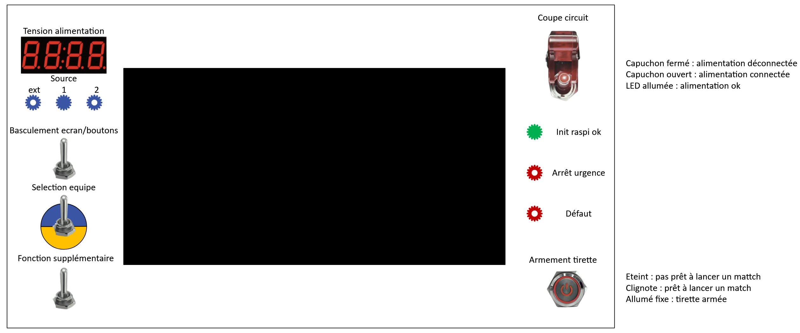

# Panneau de commande

## Objectifs

Le panneau de commande du robot doit permettre de réaliser les séquences de démarrage et de lancement de match et de faire un retour d'information sur l'état du robot sans utiliser l'écran en cas de panne de celui-ci.

L'écran tactile doit permettre de piloter toutes les cartes du robot en mode test ainsi que de sélectionner la stratégie et de réaliser la séquennce de lancement de match.

Le panneau de commande doit être amovible afin d'accéder au compartiment électronique du robot.

## Etats et modes

### Modes de fonctionnement

### Mode attente

### Mode match

### Mode test

Le mode test n'est utilisable que depuis l'écran. Il doit permettre les fonctions suivantes :
- Pilotage et retour d'info de la carte d'alim (voir [Pilotage PCB Alimentation](Pilotage-PCB-alimentation.md))
- Pilotage et retour d'info de la carte moteurs
- Pilotage et retour d'info du lidar ?
- Pilotage des actionneurs (notamment pour homologation)

## Boutons et voyants

## Schema général

{ width="800" }
(crédit : Vincent, schéma à remettre à jour)
### Voltmètre

L'indicateur 7 segment est un voltmètre qui indique la tension de l'alimentation actuelle.

### Switch haut

Le switch est en position haute : le pilotage du robot se fait via l'écran et on passera par l'état InitialisationEcran en mode match.

Le switch est en position basse : On passe en mode match après avoir atteint l'état Prêt du mode attente. L'écran est désactivé (peut être conservé pour affichage seulement) et on passera par l'état InitialisationBouton.

### Switch milieu

Inutile dans tous les autres états que l'état InitialisationBouton

Dans l'état InitialisationBouton du mode match : permet de sélectionner la couleur du robot (haut = bleu, bas = jaune)

### Switch bas

à définir (choix entre deux stratégies ? entre plusieurs zones de départ ?)

### Ecran tactile

L'ecran doit permettre d'accéder aux 3 modes de fonctionnement du robot et de passer par toutes les étapes de l'initialisation du mode match.

L'état InitialisationEcran du mode match permet plus de détail que l'état InitialisationBouton. Avec l'écran il est possible de sélectionner différente stratégie et différente zone de départ ainsi que la couleur du robot.

L'armement de la tirette ne se fait pas par l'écran mais par le bouton ON.

### Coupe-circuit général

Le switch est en position basse : le robot est dans le mode attente dans l'état éteint.

Le switch est passé en position haute : on passe dans l'état allumage

LED du switch allumée : etat SourceStable atteint (non fonctionnel actuellement)

### Matrice de LEDS

LED arrêt d'urgence : rouge, allumée si le BAU est enfoncé

LED de fin d'initialisation : verte, allumée une fois l'initialisation du robot en mode Attente terminée, quand on arrive dans l'état Prêt du mode Attente. Reste allumée ensuite tant que le programme principal tourne.

Possibilités : 
- 3 LEDS pour indiquer quelle entrée d'alimentation est sélectionnée
- LED rouge pour indiquer un défaut (batterie faible, un des transfos éteint, surchauffe)

### Bouton ON

Le bouton ON sert à armer la tirette.

Dans tout état différent de Prêt ou Armé (mode match), la led du bouton est éteinte.

Au passage à l'état prêt en mode match, si le bouton est en position haute, la led du bouton clignote.

A l'appui sur le bouton clignotant, le bouton est enfoncé, le robot passe dans l'état Armé et le bouton cesse de clignoter.

Si par un nouvel appui, le bouton revient en position haute, le robot retourne à l'état SelfTest.

Si le bouton est déjà enfoncé à la fin de l'état SelfTest, le robot doit attendre que le bouton soit désenfoncé pour passer dans l'état Prêt du mode match.